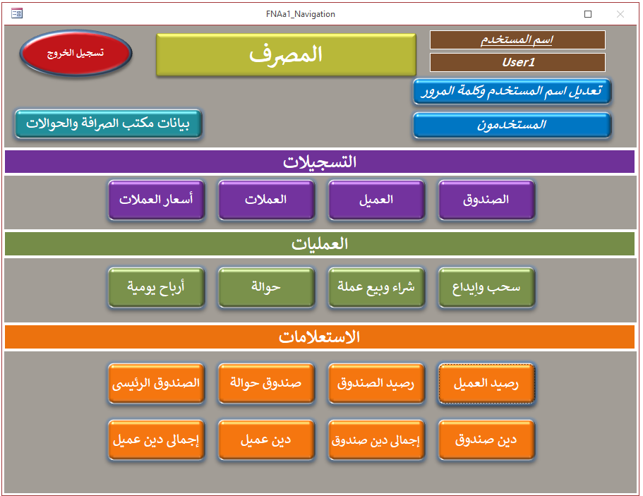
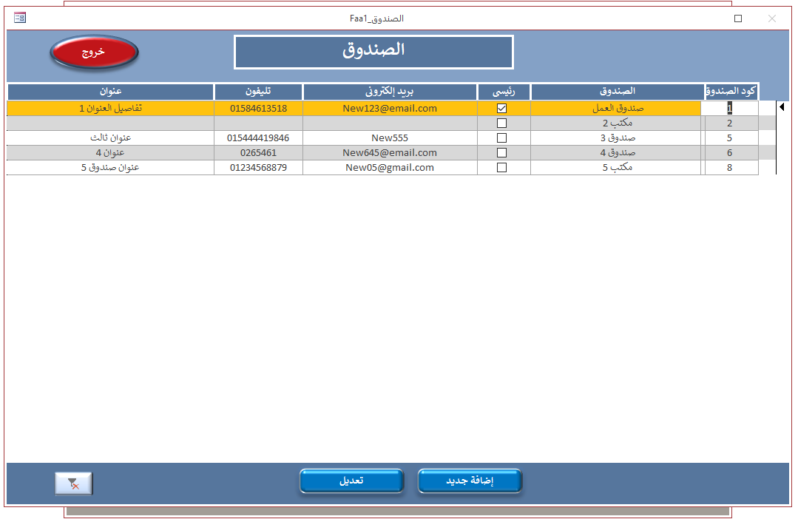
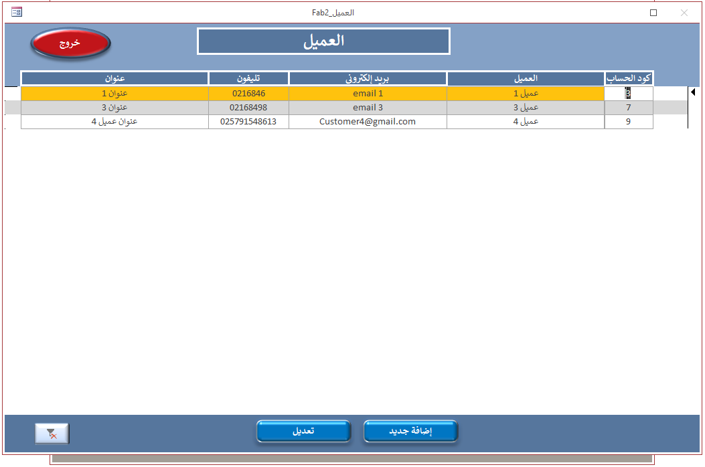
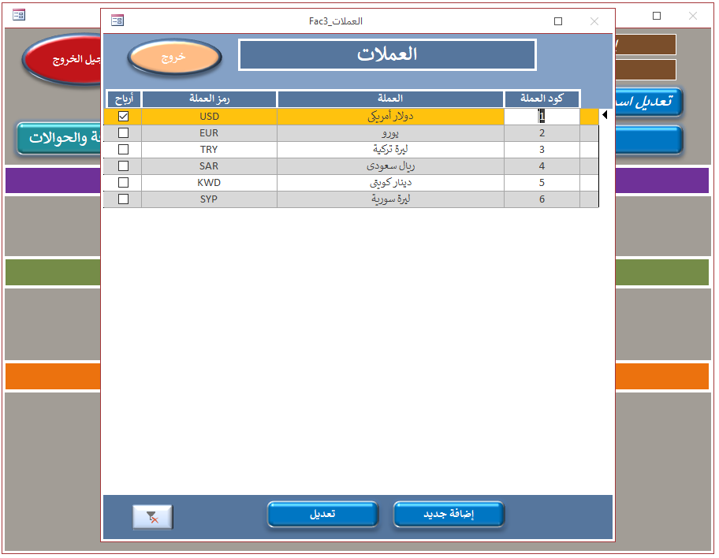
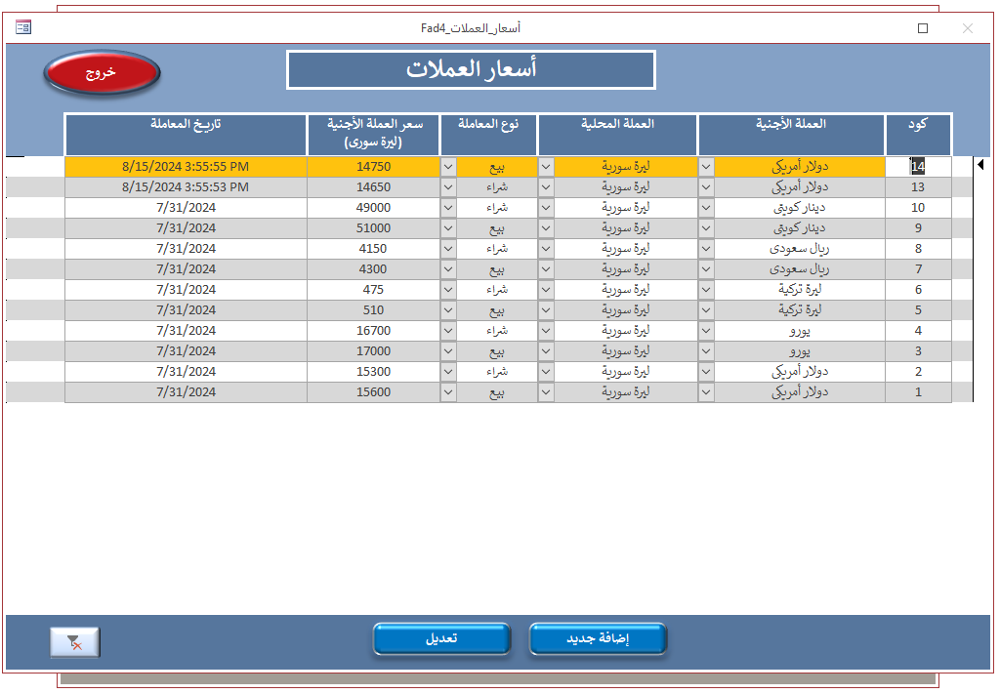
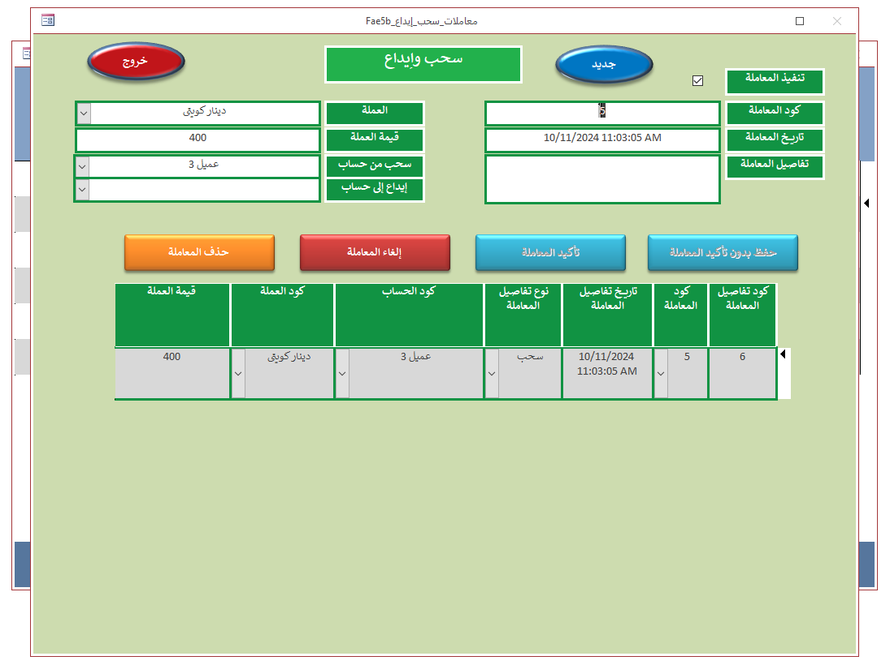
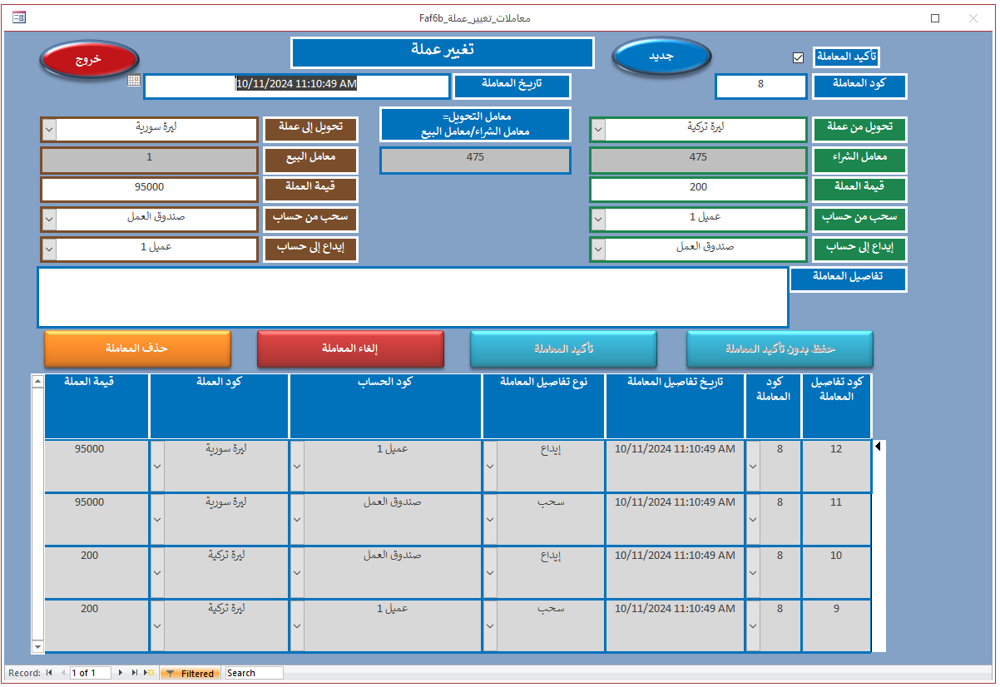
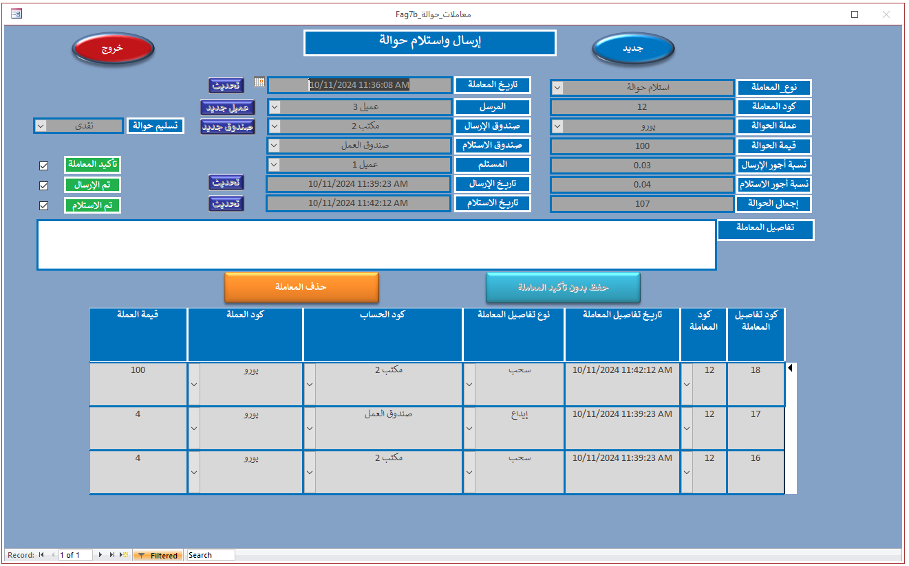

<h2 align="center">2- المصرف</h2>

  يتم تسجيل حسابات لمكاتب الصرافة وحسابات للعملاء. ويتم تسجيل العملات وأسعارها الجديدة. ثم يتم تسجيل رصيد لكل حساب فى العملات المختلفة. يتم تسجيل المعاملات والحوالات بين المكاتب. ويمكن عرض رصيد كل حساب بعد تسجيل جميع المعاملات.

<h3 align="center">
  عرض فيديو استخدام قاعدة البيانات من اليوتيوب
   
  <a href="https://www.youtube.com/watch?v=siW6q7qbbUQ">https://www.youtube.com/watch?v=siW6q7qbbUQ</a>
</h3>

<h3 align="center">
  صور قاعدة البيانات
</h3>

  
  
  
  
  
  
  
  
  
 
 
  

